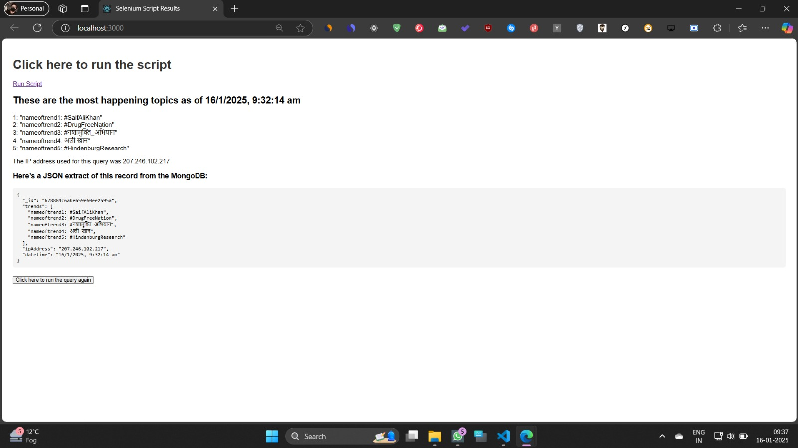

# Selenium Script Results Web App

Welcome to the **Selenium Script Results Web App**! This web application allows users to easily run a script that fetches real-time trending topics, the timestamp of the data, and the IP address used for the query. You can view the results in a neat and formatted layout, including a JSON extract of the data from a MongoDB database.

### Key Features:

- **Real-time Trending Topics**: Fetch up-to-date trending topics from a specified source.
- **Timestamp of Data**: See exactly when the data was fetched, down to the second.
- **IP Address Details**: View the IP address used for the query and the proxy IP address.
- **MongoDB JSON Extract**: View a cleanly formatted JSON extract from MongoDB with all the relevant data.
- **Re-run Queries**: Easily re-run the script with the click of a button to get updated data.
- **Responsive & User-Friendly Design**: Simple and clean UI, accessible on any device.

---

## Prerequisites

To run this project locally, you'll need the following:

- **Node.js** (with npm or yarn)
- **MongoDB** (if you want to connect to a local MongoDB database)
- **Express.js** (Backend API, used for the `/run-script` endpoint)
- **Selenium** (For web scraping and automation tasks)

---

## Installation Guide

### 1. Clone the Repository

Start by cloning this repository to your local machine:

```bash
git clone https://github.com/saurabhiiitm062/twitter_scrapping.git
cd selenium-script-results-web-app
 2. Install Dependencies
Next, install all the required dependencies:
npm install
# or
yarn install
 3. Set Up the Backend API
The backend needs to expose an endpoint (/run-script) that triggers the Selenium script and returns the results as a JSON object.

Modify this endpoint to suit your use case (e.g., interacting with your own database or scraping specific websites).
Make sure MongoDB is running locally (or connect to a remote MongoDB instance).

4. Start the Application
Now you’re ready to start the backend server:
npm start
# or
yarn start
 Backend Endpoint: /run-script
The /run-script endpoint is responsible for executing the Selenium script and returning the results as a structured JSON object.

 JSON Fields:
trends: An object containing the trending topics (indexed).
datetime: The timestamp when the data was fetched.
ipAddress: The IP address used for the query.
_id: The MongoDB document ID.
proxyIPAddress: The proxy IP address (if used).
 Running the Project
1. Start the Backend
Run the server using:
npm start
# or
yarn start
npm start
# or
yarn start

Built With:
Node.js: Server-side JavaScript for building the backend.
Express.js: Backend API for handling requests.
Selenium: For web scraping/automation tasks.
MongoDB: Database to store and retrieve the results.
HTML/CSS/JavaScript: For building the frontend.
```

output:

